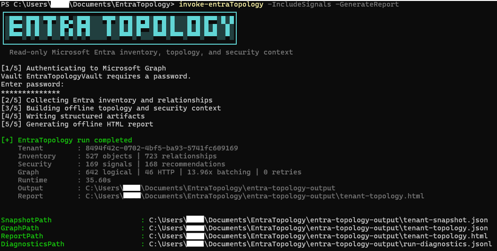
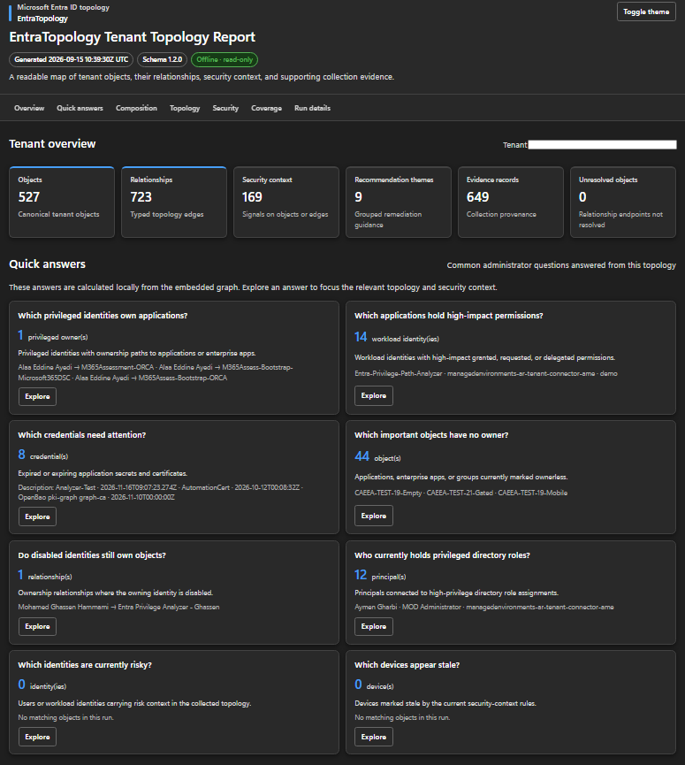
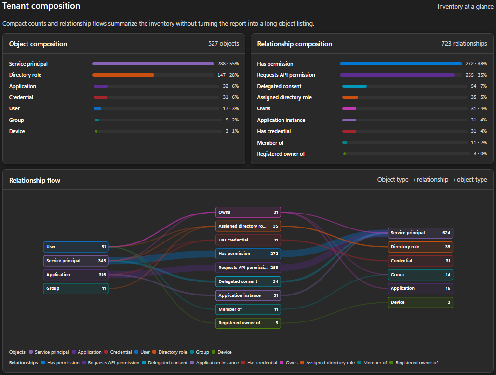
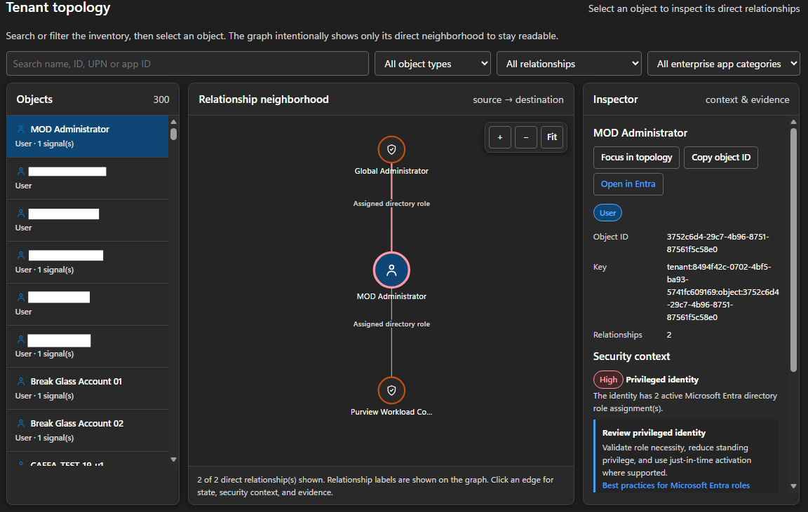
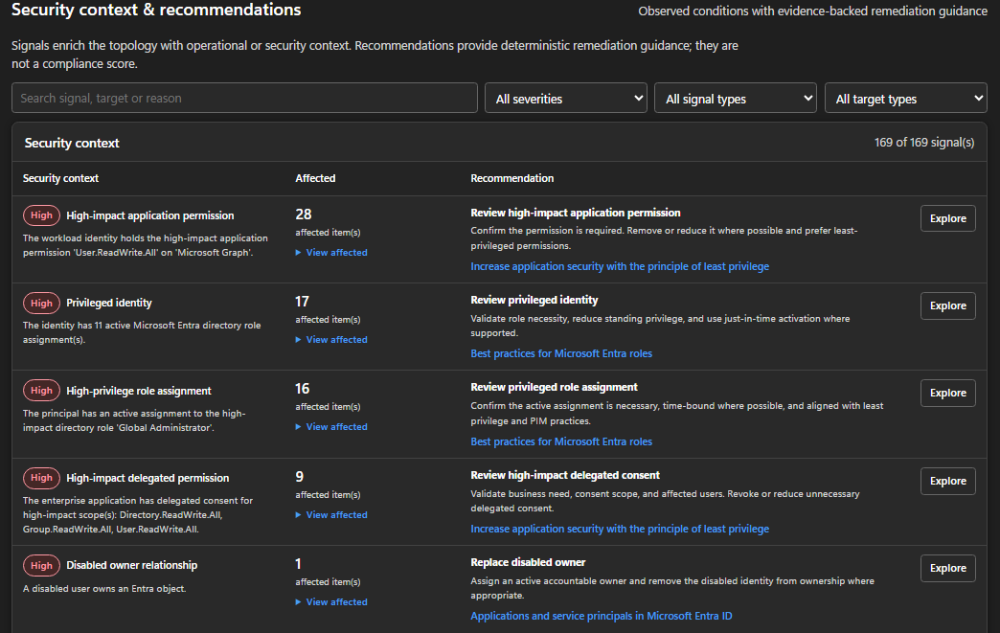

<div align="center">

# EntraTopology

**Read-only Microsoft Entra tenant topology with security context**

[](#)
[](#requirements)
[](LICENSE)

EntraTopology collects Microsoft Entra tenant state into a portable snapshot, correlates objects into a canonical relationship graph, enriches that graph with evidence-backed security context, and produces a self-contained offline topology explorer.

**Collect once. Build the topology offline. Explore relationships with context.**

[Quick start](#quick-start) · [Capabilities](#capabilities) · [Permissions](#permissions) · [Usage](#usage) · [Security model](#security-model)

</div>

---

## What it is

EntraTopology is a **read-only Microsoft Entra inventory and topology engine** built with PowerShell and Microsoft Graph. Its primary product is the tenant graph: **what exists, how objects relate, and which objects or relationships carry useful operational or security context**.

### Collect → Correlate → Explore

| Capability | What it provides |
|---|---|
| Portable snapshots | Collected tenant state that can be processed again without Microsoft Graph |
| Canonical topology | Stable nodes and relationship edges across users, groups, applications, service principals, devices and directory roles |
| Application topology | App registrations, enterprise applications, credentials, requested permissions, granted app roles and delegated consent |
| Identity context | Ownership, membership, registered ownership and active directory-role relationships |
| Security context | Coverage-aware observations such as ownerless objects, privileged ownership, risky identities, stale devices and credential expiry |
| Recommendations | Deterministic remediation guidance linked to supported security-context signals |
| Evidence | Provenance references connecting topology relationships and observations to collection evidence |
| Offline exploration | Self-contained HTML topology explorer with filtering, drill-down, Quick Answers, relationship flow and Entra portal navigation |
| Query and comparison | Local node/path queries and semantic graph comparison across versions |
| Optional monitoring | Scheduled certificate-authenticated collection, semantic drift comparison and severity-based notification |
| Interoperability | JSON, GraphML and OpenGraph-shaped exports |

> **Not a posture/compliance scanner or attack-path engine.** EntraTopology exposes deterministic tenant topology and evidence-backed context. It does not produce a tenant score or claim that observed access is unnecessary without an external expected-access baseline.

## Screenshots

<details>
<summary><b>CLI Invoke run</b></summary>


</details>

<details>
<summary><b>Tenant overview</b></summary>


</details>

<details>
<summary><b>Tenant Composition</b></summary>


</details>

<details>
<summary><b>Tenant Topology</b></summary>


</details>

<details>
<summary><b>Security Context & Recommendations</b></summary>


</details>


## Capabilities

EntraTopology currently models:

- users, groups, applications, service principals, devices and directory roles;
- group membership and ownership;
- application and service-principal ownership;
- app registration ↔ enterprise application instantiation;
- application secrets and certificate metadata as credential nodes;
- requested API permissions;
- granted application permissions/app-role assignments;
- delegated OAuth consent relationships;
- device registered owners;
- active directory-role assignments;
- typed resolution of unresolved directory principals and role definitions;
- Microsoft first-party, tenant-owned, external and managed-identity service-principal classification;
- optional Microsoft first-party enterprise-application exclusion while retaining referenced API-resource nodes;
- optional `signInActivity` and risky-user enrichment;
- coverage-aware security signals and deterministic recommendations;
- runtime telemetry, diagnostics and evidence provenance;
- optional scheduled monitoring from the repository `Monitoring/` directory.

The HTML report is topology-first: compact inventory composition, relationship-flow visualization, deterministic administrator Quick Answers, interactive topology inspection, grouped security context, coverage state, and collapsible runtime/evidence detail.

## Requirements

- PowerShell 7.2 or later
- `Microsoft.Graph.Authentication` 2.0.0 or later
- Scheduled monitoring requires `Microsoft.Graph.Authentication` 2.33.0 or later installed with `-Scope AllUsers` because the task runs as `SYSTEM`
- A Microsoft Entra application registration for app-only use, or a supported delegated Graph session for development
- For stored client-secret authentication: `Microsoft.PowerShell.SecretManagement` and a registered vault such as `Microsoft.PowerShell.SecretStore`

## Permissions

Grant only the permissions needed for the capabilities you intend to collect.

| Capability | Microsoft Graph application permission |
|---|---|
| Users | `User.Read.All` |
| Groups | `Group.Read.All` |
| Hidden-membership groups *(optional, when present)* | `Member.Read.Hidden` |
| Applications / service principals | `Application.Read.All` |
| Devices | `Device.Read.All` |
| Directory roles | `RoleManagement.Read.Directory` |
| Generic directory-object resolution and delegated OAuth grant listing | `Directory.Read.All` |
| `signInActivity` enrichment *(optional)* | `AuditLog.Read.All` |
| Risky-user context *(optional)* | `IdentityRiskyUser.Read.All` |

`IdentityRiskyUser.Read.All` also depends on the applicable Microsoft Entra ID Protection licensing. When an optional capability is unavailable, EntraTopology reports coverage as `NotRun`, `Partial`, or `Unavailable` rather than treating missing visibility as an empty successful result.

For complete group topology, EntraTopology also correlates service-principal membership and ownership through supported Microsoft Graph v1.0 reverse relationships. `Application.Read.All` or `Directory.Read.All` must therefore be available to close the known v1.0 service-principal omissions. `Member.Read.Hidden` is required only when hidden-membership groups exist; without it, group-membership coverage is reported as `Partial` rather than falsely `Complete`.

For tenant-wide delegated OAuth grants, `Directory.Read.All` is the baseline read permission used by EntraTopology. Higher-privilege alternatives such as `DelegatedPermissionGrant.ReadWrite.All` or `Directory.ReadWrite.All` are accepted when already present, but are not required for normal read-only operation.

## Quick start

Clone the repository after publication:

```powershell
git clone https://github.com/0xDarknightHacks/EntraTopology.git
cd .\EntraTopology

Install-Module Microsoft.Graph.Authentication -Scope CurrentUser
Import-Module .\EntraTopology.psd1 -Force
```

For the preferred stored app-only workflow, configure identifiers in:

```text
~/.entra-topology/config.json
```

Example:

```json
{
  "TenantId": "<tenant-id>",
  "ClientId": "<application-client-id>"
}
```

Do **not** store the client secret in that file. By default, EntraTopology reads `EntraTopologyGraphClientSecret` from the SecretManagement vault `EntraTopologyVault`.

Run the complete workflow:

```powershell
Invoke-EntraTopology -ExcludeMicrosoftFirstPartyApps -Verbose
```

The command connects when needed, collects the tenant, builds the topology, attaches security context and recommendations, writes artifacts, generates the report, and disconnects only a Graph session it created.

> Never commit tenant identifiers, secrets, snapshots, topology exports, HTML reports, diagnostics, local authentication configuration, or other tenant-derived runtime artifacts.

## Authentication

### Stored app-only client secret

```powershell
Invoke-EntraTopology
```

Custom configuration/vault names are supported:

```powershell
Invoke-EntraTopology `
    -ConfigPath C:\Secure\entra-topology-config.json `
    -VaultName MyVault `
    -SecretName MyGraphSecret
```

### Certificate app-only

```powershell
Connect-EntraTopologyGraph `
    -ClientId '<application-client-id>' `
    -CertificateTenantId '<tenant-id>' `
    -CertificateThumbprint '<thumbprint>'
```

### Caller-owned Graph session

```powershell
# Connect to Microsoft Graph using the authentication method appropriate to your environment.
Invoke-EntraTopology -SkipConnect -NoDisconnect
```

## Usage

### Run the topology workflow

```powershell
$result = Invoke-EntraTopology -ExcludeMicrosoftFirstPartyApps -PassThru
$result
```

Useful automation switches include `-SkipConnect`, `-NoDisconnect`, `-NoBanner`, `-NoProgress`, `-NoReport`, `-OpenReport`, and `-PassThru`.

### Generate an offline report

```powershell
New-EntraTopologyReport `
    -GraphPath .\entra-topology-output\tenant-topology.json `
    -Path .\entra-topology-output\tenant-topology.html
```

Report generation operates on the canonical graph and does not require Microsoft Graph.

### Query nodes

```powershell
$graph = Get-Content .\entra-topology-output\tenant-topology.json -Raw |
    ConvertFrom-Json -Depth 100

Get-EntraTopologyNode -Graph $graph -Kind application
```

### Explore paths

```powershell
Find-EntraTopologyPath -Graph $graph -From '<node-key>' -To '<node-key>'
```

### Compare topology versions

Use `Compare-EntraTopologyGraph` with two canonical graph versions to identify semantic topology changes without treating evidence/provenance churn, object-property ordering, or equivalent ISO-8601 timestamp formatting as topology drift.

### Monitor topology periodically

The optional [`Monitoring/`](Monitoring/) directory is a scheduled monitoring/notification layer over the canonical EntraTopology collection and semantic comparison pipeline. It compares each healthy graph to the last promoted baseline and can notify administrators only when changes meet a configured severity threshold. Runtime state is created under `C:\ProgramData\EntraTopologyMonitor` and remains outside the repository.

See [Monitoring/README.md](Monitoring/README.md) for certificate, ProgramData, Exchange Application RBAC, and Scheduled Task setup.

## Interactive report

The generated HTML report is self-contained and designed for offline administrative exploration. It includes:

- compact tenant/object metrics;
- object and relationship composition views;
- a semantic-color relationship Sankey;
- deterministic **Quick Answers** for common administrator questions;
- interactive topology zoom, pan and fit;
- object-type icons and explicit relationship labels;
- security-context overlays and filters;
- node/edge inspector history and topology focus actions;
- supported direct navigation to the Microsoft Entra admin center;
- grouped security context and recommendations with affected-object drill-down;
- collection coverage;
- collapsible evidence, telemetry and diagnostics.

Quick Answers are local deterministic queries against the embedded graph. They are not a chatbot and do not make additional Graph requests.

## Output artifacts

The default runtime directory is:

```text
./entra-topology-output/
```

A normal run can produce a tenant snapshot, canonical topology graph, self-contained HTML report and sanitized diagnostics. These files can contain sensitive tenant metadata and are intentionally excluded from source control/release packages.

The canonical topology graph schema is versioned independently from the PowerShell module release. A module release does **not** imply a graph-schema version change.

## Security context and recommendations

Signals are annotations on topology objects or relationships, not assessment controls. Examples include:

- ownerless tenant-owned applications/service principals;
- disabled identities or workload identities;
- stale devices;
- expired or expiring application credentials;
- risky identities when optional coverage is available;
- privileged identities and privileged ownership;
- high-impact directory-role assignments;
- curated high-impact granted/requested/delegated permissions.

Recommendations are deterministic remediation guidance derived from supported signals and linked back to their target and evidence. EntraTopology intentionally does not label an identity or application **over-privileged** without an external expected-access or business-need baseline.

## Security model

EntraTopology is designed around four boundaries:

1. **Read-only Graph access** — normal operation requires read permissions only.
2. **Snapshot boundary** — collection produces portable state; topology construction, signals, recommendations, queries, comparison and reporting operate on collected data.
3. **Fail-closed coverage** — missing permissions or failed reads are represented explicitly and do not silently become "zero objects found".
4. **Sensitive local artifacts** — generated tenant data remains local and must not be committed or published.

See [SECURITY.md](SECURITY.md) for vulnerability reporting and operational security guidance.

## Architecture

The implementation is separated into Graph transport, collectors, snapshot handling, normalization, signals, recommendations, query, comparison, export and presentation layers. Raw Graph calls stay at the collection/transport boundary; downstream topology processing remains offline. Optional scheduled monitoring is an orchestration layer under `Monitoring/` that reuses these public module contracts rather than adding a second collection or drift engine.

See [Docs/ARCHITECTURE.md](Docs/ARCHITECTURE.md) for the architectural contract.

## Validation

Run the complete test suite:

```powershell
Invoke-Pester -Path .\Tests -Output Detailed
```

For dedicated development tenants, the repository also includes a manifest-driven synthetic dataset helper:

```powershell
.\Invoke-EntraTopologyTestData.ps1 `
    -Action Populate `
    -TenantId '<tenant-id>' `
    -UserPrincipalNameDomain '<verified-domain>' `
    -Connect

.\Invoke-EntraTopologyTestData.ps1 `
    -Action Remove `
    -TenantId '<tenant-id>' `
    -ManifestPath '<manifest-path>' `
    -Connect
```

This helper is intentionally separate from normal EntraTopology operation. It performs Microsoft Graph write operations, should be used only in a dedicated test/development tenant, and removes data only from the manifest generated by a specific populate run. Optional scenarios are available with `-IncludeAppRoleGrant`, `-IncludeDelegatedGrant`, and `-IncludePrivilegedRoleAssignment`.

Before packaging or publishing a release, also run:

```powershell
.\Scripts\Test-EntraTopologyRelease.ps1
```

The release gate rejects known runtime tenant artifacts and local EntraTopology configuration from the repository tree.

## Repository structure

```text
EntraTopology/
├── EntraTopology.psd1
├── EntraTopology.psm1
├── Invoke-EntraTopologyTestData.ps1
├── Private/
├── Public/
├── Schemas/
├── Scripts/
├── Monitoring/
├── Tests/
├── Docs/
├── README.md
├── SECURITY.md
├── CONTRIBUTING.md
├── CHANGELOG.md
├── THIRD-PARTY-NOTICES.md
└── LICENSE
```

## Contributing

Contributions are welcome when they preserve the project's topology-first, read-only and offline-processing boundaries. See [CONTRIBUTING.md](CONTRIBUTING.md).

## Security

Do not report vulnerabilities or expose tenant data through public issues. See [SECURITY.md](SECURITY.md).

## License

EntraTopology is released under the [MIT License](LICENSE). Third-party acknowledgements are documented in [THIRD-PARTY-NOTICES.md](THIRD-PARTY-NOTICES.md).
